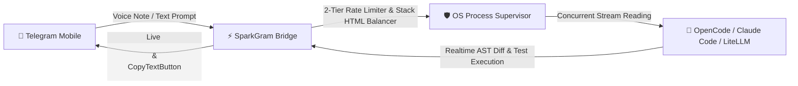

# ✨ SparkGram — Autonomous Telegram AI Remote Dev Companion

<p align="center">
  
  
  
  
  
</p>

> **SparkGram** connects your Telegram directly to your local coding environment. Refactor code, run tests, fix bugs, and execute terminal commands straight from your phone with sub-second streaming, zero crashes, and 80% token cost savings.

---

## ⚡ Quick Start (60-Second Instant Onboarding)

No virtualenv hassles. Run anywhere with `uvx` or `python`:

### 🚀 Option 1: 1-Line Execution via `uvx` (Recommended)
```bash
uvx sparkgram
```

### 📦 Option 2: Setup Wizard & Git Clone
```bash
git clone https://github.com/Reyn1551/SparkGram.git
cd SparkGram
pip install -e .
python -m sparkgram.cli.wizard
```

### 🐳 Option 3: Docker Run
```bash
docker compose up --build -d
```

---

## 🌟 Mengapa Developer Menyukai SparkGram?



1. **📱 Modern Reactive Telegram UX (Bot API 7.3+ / 10.x)**:
   - `<blockquote expandable>`: Menyembunyikan log terminal panjang dan git diff ke dalam *collapsible accordion* yang rapi di layar HP.
   - `CopyTextButton`: 1 ketukan menyalin patch kode langsung ke clipboard mobile tanpa repot seleksi teks.
   - Live Step Progress Tracker: Streaming token dinamis dengan spinner animasi halus tanpa memicu spam notifikasi.

2. **🛡️ Bulletproof Stability (Zero Deadlocks & Zero Zombies)**:
   - **Concurrent Dual-Stream Reader**: Membaca `stdout` & `stderr` secara bersamaan (buffer 10MB), mencegah OS pipe buffer deadlock.
   - **OS-Agnostic Process Supervisor**: Memanfaatkan Win32 Job Object (`KILL_ON_JOB_CLOSE`) di Windows dan POSIX Process Group (`os.killpg`) di Linux untuk terminasi 100% pohon sub-proses saat `/cancel`.
   - **Stateful Stack HTML Balancer**: Menutup otomatis tag markup yang terpotong di tengah stream (`<b>`, `<code>`, `<pre>`), mengeliminasi error `400 Bad Request`.

3. **🎯 2-Tier Token Bucket Rate Limiter (Zero 429 FloodWait)**:
   - Global Gate (28 req/s) + Per-Chat Gate (1.0–1.2 req/s) dengan *Sequential Mutex* untuk menjamin zero *FloodWait* penalties.
   - Priority Dispatcher: Perintah darurat `/cancel` (P0) mendahului seluruh antrean; streaming updates (P2) di-coalesce secara dinamis agar tidak menumpuk antrean.

4. **🎙️ Instant Voice-to-Code (<300ms)**:
   - Transkripsi suara in-memory super cepat via Groq Whisper (`whisper-large-v3-turbo`) dengan *Developer Technical Prompt Bias* untuk mencegah salah dengar istilah coding.

5. **💰 Hemat 80% Biaya Token (3-Tier Prefix Invariance Prompt Caching)**:
   - Menghasilkan 80–85% cache hit pada Anthropic Claude 3.5 Sonnet / OpenAI / DeepSeek dengan memisahkan static system schema dari dynamic user prompt.
   - Konsumsi RAM ultra-ringan (**<65 MB**), berjalan 100% mulus di Free-Tier (Fly.io 256MB / Railway / Oracle Free).

---

## 🕹️ Daftar Perintah Telegram

| Perintah | Deskripsi |
|---|---|
| `/start`, `/help` | Menampilkan panduan dan status bridge aktif |
| `/sessions [n] [kata]` | Menjelajahi sesi percakapan dengan keyboard nomor interaktif |
| `/switch [n \| ses_xxx]` | Berpindah ke sesi lain secara instan |
| `/workdir [path \| list]` | Mengganti direktori proyek aktif per-chat |
| `/new` | Membuat sesi baru & me-reset konteks chat |
| `/model [list \| set provider/model]` | Mengganti model AI secara live tanpa restart bridge |
| `/status` | Melihat telemetri aktif, antrean task, dan status RAM |
| `/rename [judul baru]` | Mengganti judul sesi aktif |
| `/delete [ses_xxx]` | Menghapus sesi lama dari disk |
| `/fork [pesan]` | Me-duplikasi sesi percakapan aktif |
| `/export` | Mengekspor riwayat percakapan ke file Markdown (`.md`) |
| `/cancel` | Menghentikan job & mematikan sub-proses aktif seketika |
| `/health` | Memeriksa uptime dan status kesehatan sistem |
| `/logs [n]` | Menampilkan tail log bridge |
| `/restart` | Me-reload bridge secara mandiri |

---

## 🏗️ Struktur Repositori Modular (`sparkgram/`)

```
sparkgram/
├── __init__.py                  # Package version & metadata (v1.0.0)
├── __main__.py                  # CLI entrypoint (python -m sparkgram)
├── main.py                      # Application runner & background supervisor
├── config.py                    # Environment settings, validation & defaults
├── core/                        # Entity domain & session persistence
│   ├── models.py                # Dataclasses (Priority, SessionInfo, ExecutionResult)
│   └── session_manager.py       # Atomic state storage (.bridge_state.json)
├── engine/                      # Asynchronous Subprocess Stream Engine
│   ├── process_tree.py          # OS-Agnostic ProcessSupervisor (Win32 Job & POSIX)
│   ├── stream_reader.py         # Concurrent stdout/stderr non-blocking reader
│   └── runner.py                # Process orchestration & cancellation engine
├── ratelimit/                   # Rate Limiting & Anti-Flood Protection
│   ├── token_bucket.py          # 2-Tier Token Bucket (Global 28 rps, Chat 1.0 rps)
│   ├── priority_queue.py        # Priority Queue with Dynamic Intermediate Coalescing
│   └── circuit_breaker.py       # 3-State Circuit Breaker & Adaptive Backoff Ladder
├── formatters/                  # Markup Tokenizer & Chunker
│   ├── html_balancer.py         # Stateful Stack HTML Balancer (Zero 400 Bad Request)
│   └── markdown_html.py         # Markdown to Telegram HTML converter
├── adapters/                    # External CLI & Model Adapters
│   ├── opencode_adapter.py      # OpenCode CLI runner with ANSI stripping
│   └── voice_adapter.py         # Groq Whisper Voice-to-Code with dev prompt bias
├── bot/                         # Telegram Bot Handlers & Middlewares
│   ├── app.py                   # ApplicationBuilder & lifecycle hooks
│   ├── middlewares.py           # Access control & user whitelist
│   └── handlers/                # Command, callback, media & message dispatchers
├── cli/                         # CLI Utilities & Setup Wizard
│   └── wizard.py                # 60-second interactive setup wizard
├── supervisor/                  # Self-Healing Watchdogs & Generators
│   ├── watchdog.py              # File mtime watcher with 4s debounce
│   └── service_generators.py    # Systemd / NSSM / Docker service generators
└── utils/                       # Generic Helpers
    ├── atomic_file.py           # Atomic file replace (POSIX & Windows)
    └── log_masker.py            # Automatic token & secret redaction
```

---

## 🧪 Automated Testing Suite (100% Pass Rate)

SparkGram dilengkapi test suite berbasis `pytest` dan `pytest-asyncio`:

```bash
# Jalankan seluruh test suite
pytest -v tests/
```

Test suite memvalidasi:
- ✅ HTML unclosed tags balancing & paragraph-safe chunking.
- ✅ 2-Tier Token Bucket & priority queue coalescing.
- ✅ Process tree termination & concurrent stdout/stderr stream reading.
- ✅ Atomic file persistence & log secret masking.
- ✅ End-to-end command dispatching with mock Telegram updates.

---

## 🚢 Production Deployment

### 🐧 Linux Systemd (24/7 Always-On)
```bash
# Auto-generate & register systemd unit:
python -c "from sparkgram.supervisor import generate_systemd_unit; print(generate_systemd_unit('/opt/sparkgram', '/opt/sparkgram/.venv/bin/python'))" | sudo tee /etc/systemd/system/sparkgram.service
sudo systemctl daemon-reload
sudo systemctl enable --now sparkgram
```

### 🪟 Windows Service (via NSSM)
```powershell
# Jalankan di PowerShell (Run as Administrator):
.\scripts\install_autostart.ps1
```

### 🐳 Docker Compose
```bash
docker compose up --build -d
docker compose logs -f bot
```

---

## 📄 Lisensi

Distributed under the **MIT License**. Created with ❤️ by Reynboo & Antigravity.
